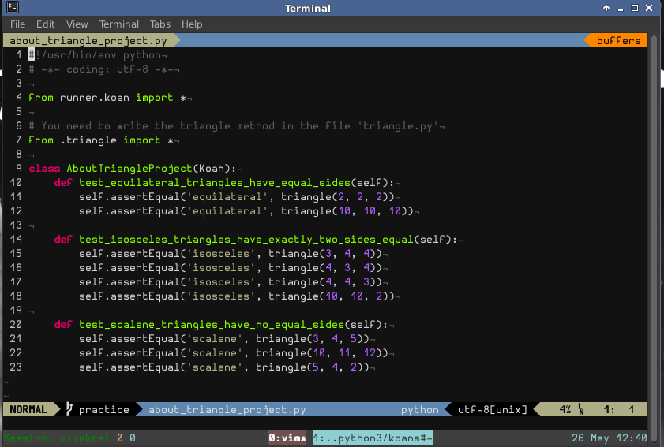

I have completely revamped my older Vim configuration and hence I had to do a forced
push. If you were using previous repository, you may wish to have look at this
newer one. I will briefly list the changes here.

Changes
-------
* `.git` tree structure was disrupted because of my experiments with git. Now all
the plugins are imported as submodules to ensure that you get the latest and
stable versions.
* Plugins were selected carefully and useful options were set.
* Updated Vim to latest version 7.4.227.
* Revamped .vimrc, removed redundant entries, streamlined plugin options.
* Molokai to be used as default theme.

### Update on 29 June 2014
I have pushed another branch `minimal` which removes many of plugins that require more
than a little effort on the part of user who is new to vim. The branch has just
enough set of plugins to get started with a nicer interface and accordingly set
settings. Hence you have two choices, 

1. Clone the `master` using the instructions below and checkout the
   important note **OR**

2. Clone the `minimal` using the same instructions and get going. No further
   tweaking should be required. Feel free to add plugins and other settings
   of your own choice.

Installation
------------
    git clone -b minimal --single-branch https://github.com/vivekiitkgp/Dotfiles-vim.git ~/.vim
    cd .vim
    git submodule init
    git submodule update
    git submodule foreach git submodule init
    git submodule foreach git submodule update

*Symlinks*

    ln -s ~/.vim/.vimrc ~/.vimrc
    ln -s ~/.vim/.gvimrc ~/.gvimrc

Although I do not plan to add anything new at the moment, you can see frequent
changes in the .(g)vimrc file.

Important
---------
### (For `minimal` branch)
* If you see strange characters in status line or improper appearance then please see the [FAQs] (https://github.com/bling/vim-airline/wiki/FAQ) for the `vim-airline` plugin.

Screenshot
----------
The following is a screenshot of vim in terminal (using tmux) with Python Koans file open.

Feedback
--------
Feel free to drop fork, modify or suggest any changes you like.
